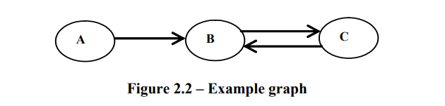
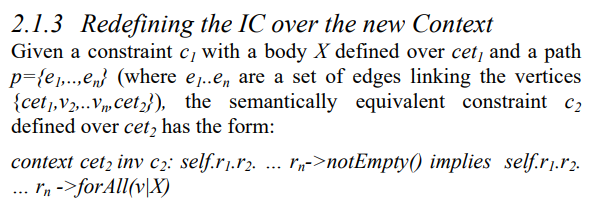
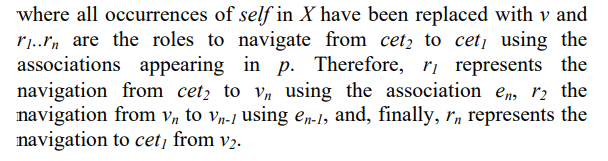
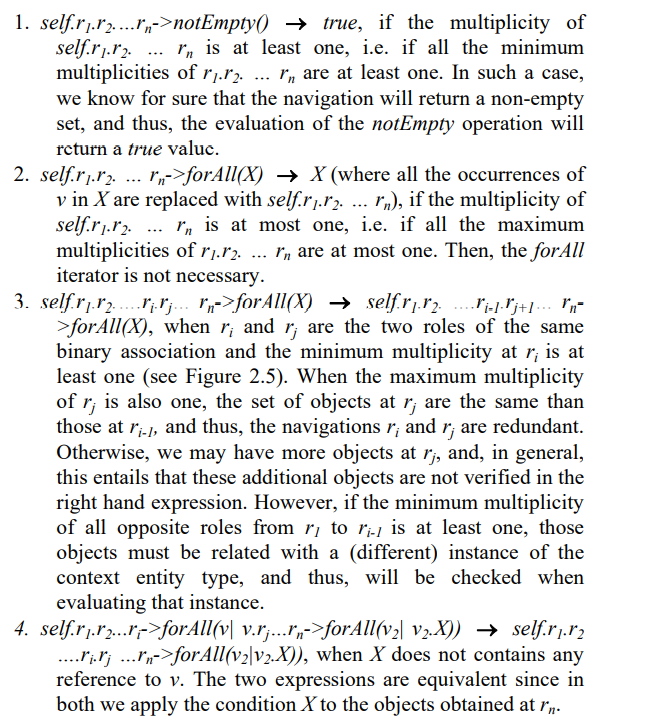
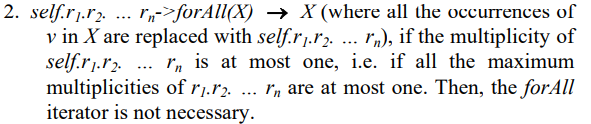
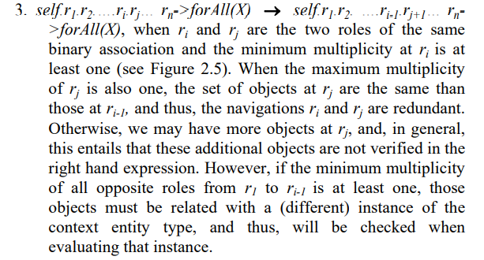
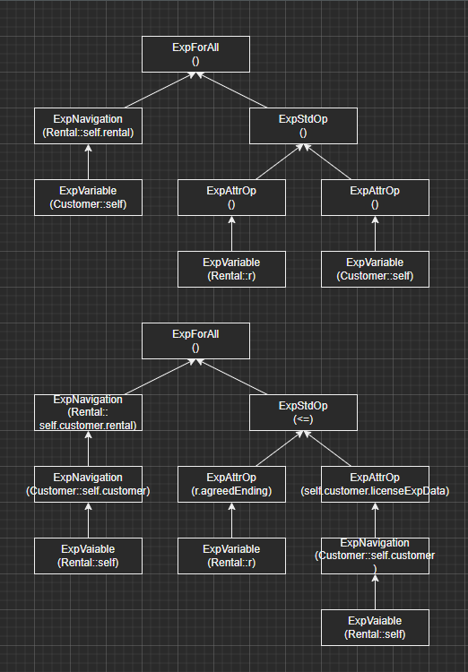

改变cotext的前提，至少有一个association过程seq~as~ 包括了cet1,cet2.

并且seq~as~ 需要保证，在cet1作为context时，cet1的实例集全体与以cet2为context时，从cet2导航到cet1的实例集全体相同。即，改变context后，不能改变cet1原有受影响的实例集。

We can determine whether set~cet1~ = set’~cet1~ by studying the  multiplicity of the associations included in seq~as~


从context A转到B，需要多重性上，一个A实例对应至少一个B实例，这样从B导航到A时，才能包括所有A。


用图方法解决L


图的定义：

将model用单向图表示，实体类作为定点，关系作为边，利用多重性定义边的指向，可以得到context转化关系。

如果存在A->B的路径。所有context为A的ic都可以转化成B为context




第一步转化为一般式子






最最重要的，4条化简规则：




第一步，在X外部添加节点forAll，改变context

```
	public MClassInvariant transformStep1(MClassInvariant preInv, MClassImpl tarContext) {
        Expression body = preInv.bodyExpression().copy();
        MClass srcContext = preInv.cls();

        Expression path = getPathFrom(srcContext, tarContext);//构造一个从srcContext->tarContext的ExpNavigation表达式，如self.rental

        String varName = findVarNotInExp(body);

        changeNameOfVarInExp(body, "self", varName);    //把body里的self名字改为varName

        VarDecl var = new VarDecl(varName, srcContext);  //此变量var和self同类型

        //构造一个forAll表达式，把原来的body包起来
        ExpForAll root = null;
        try {
            root = new ExpForAll(var, path, body);
        } catch (ExpInvalidException e) {
            e.printStackTrace();
        }

        String tarInvName = preInv.name()+tarContext.name();
        List<String> varList = new ArrayList<>();
        varList.add("self");

        //构造新的Inv
        MClassInvariant tarInv = null;
        try {
            tarInv = new MClassInvariant(tarInvName, varList, tarContext, root, false);
        } catch (ExpInvalidException e) {
            e.printStackTrace();
        }

        return tarInv;
    }
```


第二步，根据4条规则，对表达式进行化简

```
	public MClassInvariant transformStep2(MClassInvariant preInv) {
        Expression body = preInv.bodyExpression().copy();   //获取原约束的body

        int n = -1;
        while ((n = checkRules(body)) != -1) {  //不断检查是否满足某条化简rule
            body = applyRules(body, n);         //执行对应rule的过程
        }
        //若不能再应用任何rule，退出

        //用新的body构造新的约束inv
        MClassInvariant tarInv = null;
        try {
            List<String> varList = new ArrayList<>();
            varList.add("self");
            tarInv = new MClassInvariant(preInv.name(), varList, preInv.cls(), body, preInv.isExistential());
        } catch (ExpInvalidException e) {
            e.printStackTrace();
        }
        return tarInv;
    }
```


rule 2:   消除forAll




```
	Boolean checkRule2(Expression exp_){
        Expression exp = exp_.copy();

        if(!(exp instanceof ExpForAll))
            return false;

        //获取左子树，path，例如self.rental
        Expression path = ((ExpForAll) exp).getRangeExpression();
        //path如果是ExpNavigation，就要判断目的端dst的多重度是否大于1
        //如果是ExpVariable，说明走到了path的末端，跳出循环
        while(path instanceof ExpNavigation){
            MAssociationEnd dst = (MAssociationEnd) ((ExpNavigation) path).getDestination();
            MMultiplicity multi = dst.multiplicity();
            List<MMultiplicity.Range> ranges = multi.getRanges();
            int upper = ranges.get(0).getUpper();   //获取到多重度
            if(upper > 1)
                return false;
            else
                path = ((ExpNavigation) path).getObjectExpression();    //继续判断当前节点的子节点
        }

        return true;
    }
```


```
//执行过程：
    Expression applyRule2(Expression exp_){
        Expression exp = exp_.copy();
        Expression path = ((ExpForAll)exp).getRangeExpression();
        Expression body = ((ExpForAll)exp).getQueryExpression();

        VarDecl var = ((ExpForAll) exp).getVariableDeclarations().varDecl(0);
        String varName = var.name();

        replaceVarWithExp(body,varName,path);//把body中"self"节点替换为path

        return body;
    }

    void replaceVarWithExp(Expression body,String varName,Expression tarExp){
        if (body instanceof ExpVariable){   //判断当前节点的类型和名字
            if(body.name().equals(varName)){
                body = tarExp.copy();   //由于body是引用类型，直接为其new新节点，则原来的body也会改变
                return;
            }
        }
        //若当前节点不是self，则要递归地处理其每个子节点
        Expression child = null;
        while ((child = getNext(body))!=null){
            replaceVarWithExp(child,varName,tarExp);
        }


    }

```


## rule 3



```
//
rule3Process(Expression exp){
	
}
```


替换后如图：



原表达式：

self.rental->forAll(r : Rental | (r.agreedEnding <= self.licenseExpDate))

替换后：

self.customer.rental->forAll(r:Rental | r.agreedEnding <= self.customer.licenseExpDate)

