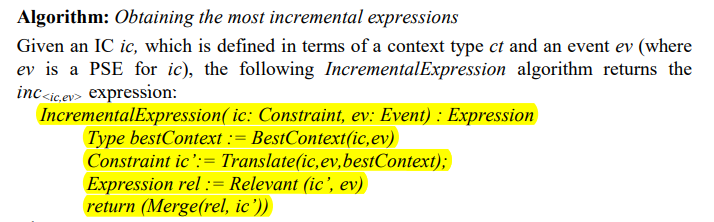

算法：已知 ic, PSE， 计算最佳的增量表达式。

对于不同的PSE，ic的最佳上下文可以变化，并生成不同的ic'

关键的步骤：Translate()，获取ic'.

分两步：

1. 输入：ic, ev 。修改树，移除无关节点。得到剪枝后的树tr
2. 输入：tr, context t ，t', ev 。redefine over context t'。

详细过程：

Cabot, J., Teniente, E.: Transforming OCL Constraints: A Context Change Approach.  In: Proc. 21st Annual ACM Symposium on Applied Computing (Model  Transformation Track), (2006) 

